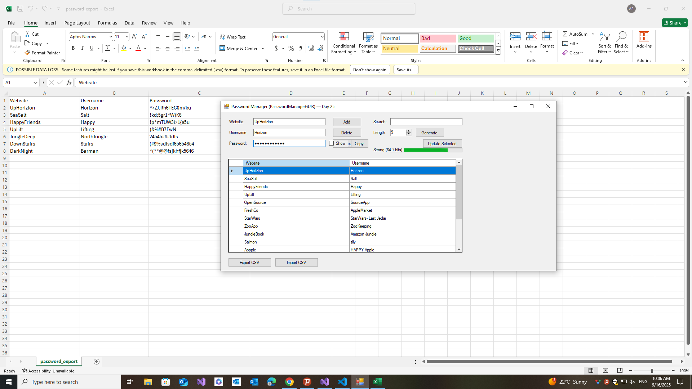

# 🔐 PasswordManagerGUI4

A simple **Windows Forms Password Manager** built with **C# (.NET Framework 4.7.2)** and **SQLite**.  
This repo is part of a project-based C# learning path. **Day 25** adds a **Password Generator**, **Strength Meter**, **Show/Hide**, and **Copy-to-Clipboard with auto-clear**.

---

## ✨ Features

- **Accounts CRUD**: Add / Update / Delete
- **Reveal password** (decrypt-on-demand)
- **Search** by Website/Username
- **CSV**: Export (⚠️ plaintext passwords) / Import (skips duplicates)
- **Day 25 Additions**
  - 🔧 **Password Generator** (8–64 chars, cryptographic RNG)
  - 📊 **Strength Meter** (entropy-based progress + label)
  - 👁️ **Show/Hide** password
  - 📋 **Copy** to clipboard with **auto-clear** after 10s

---

## 📚 Learning Goals

- Build a **WinForms** desktop app from scratch  
- Use **SQLite** in C# with `Microsoft.Data.Sqlite`  
- Implement **CRUD** with parameterized queries  
- Bind and filter data with **DataGridView**  
- Handle **file I/O**: CSV export/import with safe parsing  
- Add **UX improvements**: generator, strength meter, copy timer  
- Understand **basic AES** encrypt/decrypt (demo-only)  
- Manage **platform targets** (x64 vs Any CPU) and native SQLite dependencies

---

## 🖼 UI Preview

| 🔐 |
|------|
|  | 

> Put PNGs in a `/screenshots/` folder.

---

## 🛠 Tech Stack

- **C#** (.NET Framework 4.7.2)  
- **Windows Forms**  
- **SQLite** (`Microsoft.Data.Sqlite` + `SQLitePCLRaw.bundle_e_sqlite3`)  

---

## 📂 Project Structure

PasswordManagerGUI3/
│
├── Program.cs # App entry (SQLite init + run Form1)

├── Form1.cs # Logic: CRUD, search, CSV, crypto, generator

├── Form1.Designer.cs # UI layout + event wiring

├── Form1.resx # Designer resources

├── passwords.db # Auto-created SQLite DB at runtime

└── README.md

----
## 🧩 Usage Tips

- **Generate** a password → adjust length → click **Generate**

- **Strength Meter** updates live as you type or generate

- **Copy** password → clipboard auto-clears in **10 seconds**

- **Search** filters the grid by Website/Username

- **Update** Selected → edits Website/Username; set Password to update it too

- **Export CSV** → plaintext passwords (for portability; handle carefully)

- **Import CSV** → skips duplicates on (Website, Username)

